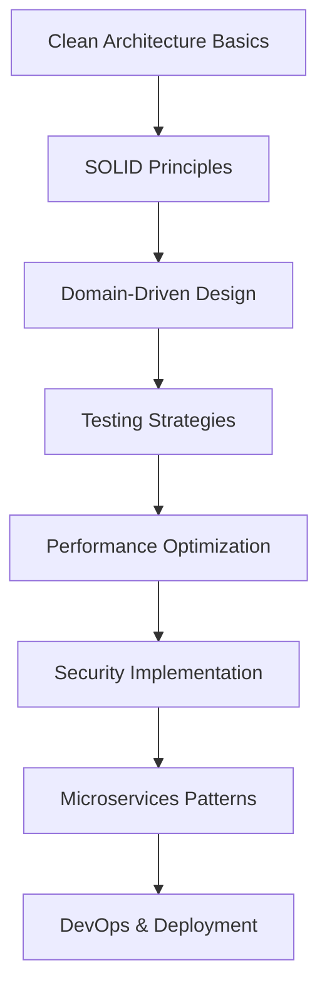

# Developer Guide - Getting Started with the SOLID Template

This comprehensive guide provides developers with everything needed to quickly become productive with the SOLID Template, including best practices, tips, tricks, and essential resources.

## 🎯 Quick Start for New Developers

### Prerequisites Setup

Before diving into development, ensure your environment is properly configured:

```bash
# Install required tools
winget install Microsoft.DotNet.SDK.8
winget install Microsoft.VisualStudio.2022.Community
winget install Git.Git

# Verify installations
dotnet --version  # Should show 8.0.x
git --version

# Recommended VS Code extensions (if using VS Code)
code --install-extension ms-dotnettools.csharp
code --install-extension ms-dotnettools.csdevkit
code --install-extension bradlc.vscode-tailwindcss
```

### First Steps Checklist

- [ ] Clone the repository
- [ ] Build the solution (`dotnet build`)
- [ ] Run tests (`dotnet test`)
- [ ] Start the API (`dotnet run`)
- [ ] Verify Swagger UI works (http://localhost:5000/swagger)
- [ ] Review project structure
- [ ] Read this developer guide completely

## 🏗️ Architecture Deep Dive

### Understanding the Layers

The template follows **Clean Architecture** with clear separation of concerns:

```
┌─────────────────────────────────────┐
│           Presentation              │  ← Controllers, API endpoints
├─────────────────────────────────────┤
│           Application               │  ← Services, DTOs, Validators  
├─────────────────────────────────────┤
│           Infrastructure            │  ← Repositories, Database, External APIs
├─────────────────────────────────────┤
│              Domain                 │  ← Entities, Business Rules, Interfaces
└─────────────────────────────────────┘
```

### Dependency Rules

**Critical Rule:** Dependencies point inward only!

- ✅ **Presentation** → Application → Domain
- ✅ **Infrastructure** → Domain  
- ❌ **Domain** should never depend on outer layers

### Key Design Patterns Used

| Pattern | Usage | Example |
|---------|-------|---------|
| **Repository** | Data access abstraction | `IProductRepository` |
| **Service Layer** | Business logic orchestration | `ProductService` |
| **DTO** | Data transfer objects | `CreateProductDto` |
| **Dependency Injection** | Loose coupling | Constructor injection |
| **CQRS (Light)** | Read/Write separation | Different DTOs for operations |
| **Factory** | Object creation | Service registration |

## 💡 Development Best Practices

### 1. Feature Development Workflow

Follow this proven workflow for new features:

```bash
# 1. Create feature branch
git checkout -b feature/product-management

# 2. Follow layer-by-layer approach
# Domain → Infrastructure → Application → Presentation → Tests

# 3. Test continuously
dotnet test

# 4. Document as you go
# Add XML comments, update README if needed

# 5. Review and refactor
# Check SOLID principles compliance
```

### 2. Code Organization Tips

#### Naming Conventions
```csharp
// ✅ Good naming
public class ProductService : IProductService
public async Task<BaseResponseDto<ProductDto>> CreateAsync(CreateProductDto dto)
public const string CACHE_KEY_PRODUCTS = "products:all";

// ❌ Poor naming  
public class PS : IPS
public async Task<object> DoStuff(object thing)
public const string KEY = "key1";
```

#### File Organization
```
Domain/
├── Entities/          # Business entities
├── Interfaces/        # Repository and service contracts
└── Enums/            # Domain enumerations

Application/
├── DTOs/             # Data transfer objects
├── Interfaces/       # Application service contracts  
├── Services/         # Business logic implementation
├── Validators/       # Input validation rules
└── Mappings/         # AutoMapper profiles

Infrastructure/
├── Data/             # DbContext and configurations
├── Repositories/     # Data access implementations
└── Services/         # External service implementations

Presentation/
├── Controllers/      # API endpoints
└── Extensions/       # DI container configuration
```

### 3. Testing Strategy

#### Test Pyramid
```
    E2E Tests           (Few - High Confidence)
      ↗     ↖
Integration Tests    (Some - Medium Confidence)  
      ↗     ↖
   Unit Tests         (Many - Fast Feedback)
```

#### Testing Best Practices
```csharp
// ✅ Good test structure - AAA Pattern
[Fact]
public async Task CreateProduct_WithValidData_ReturnsSuccess()
{
    // Arrange
    var createDto = new CreateProductDto { Name = "Test Product", Price = 10.99m };
    var expectedProduct = new Product { Id = 1, Name = "Test Product" };
    
    _mockRepository.Setup(x => x.AddAsync(It.IsAny<Product>()))
               .ReturnsAsync(expectedProduct);

    // Act
    var result = await _productService.CreateAsync(createDto);

    // Assert
    result.Should().NotBeNull();
    result.Success.Should().BeTrue();
    result.Data.Name.Should().Be("Test Product");
}
```

## 🔧 Development Tools & Shortcuts

### Essential VS Extensions

```json
{
  "recommendations": [
    "ms-dotnettools.csharp",
    "ms-dotnettools.csdevkit", 
    "ms-dotnettools.vscode-dotnet-runtime",
    "formulahendry.auto-rename-tag",
    "bradlc.vscode-tailwindcss",
    "ms-vscode.vscode-json"
  ]
}
```

### Useful Code Snippets

Create these in VS Code (File → Preferences → Configure User Snippets → csharp.json):

```json
{
  "Create Service": {
    "prefix": "service",
    "body": [
      "public class ${1:Name}Service : I${1:Name}Service",
      "{",
      "\tprivate readonly I${1:Name}Repository _repository;",
      "\tprivate readonly IMapper _mapper;",
      "",
      "\tpublic ${1:Name}Service(I${1:Name}Repository repository, IMapper mapper)",
      "\t{",
      "\t\t_repository = repository;",
      "\t\t_mapper = mapper;", 
      "\t}",
      "",
      "\tpublic async Task<BaseResponseDto<${1:Name}Dto>> CreateAsync(Create${1:Name}Dto dto)",
      "\t{",
      "\t\ttry",
      "\t\t{",
      "\t\t\tvar entity = _mapper.Map<${1:Name}>(dto);",
      "\t\t\tvar created = await _repository.AddAsync(entity);",
      "\t\t\tvar result = _mapper.Map<${1:Name}Dto>(created);",
      "\t\t\treturn BaseResponseDto<${1:Name}Dto>.Success(result);",
      "\t\t}",
      "\t\tcatch (Exception ex)",
      "\t\t{",
      "\t\t\treturn BaseResponseDto<${1:Name}Dto>.Failure($\"Error creating ${1:Name}: {ex.Message}\");",
      "\t\t}",
      "\t}",
      "}"
    ],
    "description": "Create a new service class"
  },
  
  "Create Controller": {
    "prefix": "controller",
    "body": [
      "[ApiController]",
      "[Route(\"api/[controller]\")]",
      "public class ${1:Name}Controller : ControllerBase",
      "{",
      "\tprivate readonly I${1:Name}Service _service;",
      "",
      "\tpublic ${1:Name}Controller(I${1:Name}Service service)",
      "\t{",
      "\t\t_service = service;",
      "\t}",
      "",
      "\t[HttpGet]",
      "\tpublic async Task<ActionResult<BaseResponseDto<IEnumerable<${1:Name}Dto>>>> GetAll()",
      "\t{",
      "\t\tvar result = await _service.GetAllAsync();",
      "\t\treturn result.Success ? Ok(result) : BadRequest(result);",
      "\t}",
      "",
      "\t[HttpPost]",
      "\tpublic async Task<ActionResult<BaseResponseDto<${1:Name}Dto>>> Create([FromBody] Create${1:Name}Dto dto)",
      "\t{",
      "\t\tif (!ModelState.IsValid)",
      "\t\t\treturn BadRequest(ModelState);",
      "",
      "\t\tvar result = await _service.CreateAsync(dto);",
      "\t\treturn result.Success ? CreatedAtAction(nameof(GetById), new { id = result.Data?.Id }, result) : BadRequest(result);",
      "\t}",
      "}"
    ],
    "description": "Create a new API controller"
  }
}
```

### PowerShell Development Scripts

Create these helpful scripts in your project root:

**`dev-setup.ps1`**
```powershell
# Developer setup script
Write-Host "🚀 Setting up SOLID Template development environment..." -ForegroundColor Green

# Restore packages
Write-Host "📦 Restoring NuGet packages..." -ForegroundColor Yellow
dotnet restore

# Build solution
Write-Host "🔨 Building solution..." -ForegroundColor Yellow
dotnet build

# Run tests
Write-Host "🧪 Running tests..." -ForegroundColor Yellow
dotnet test --no-build

# Check for EF tools
if (!(Get-Command "dotnet-ef" -ErrorAction SilentlyContinue)) {
    Write-Host "📊 Installing Entity Framework tools..." -ForegroundColor Yellow
    dotnet tool install --global dotnet-ef
}

Write-Host "✅ Setup complete! Ready to develop." -ForegroundColor Green
Write-Host "💡 Tip: Run 'dotnet run' to start the API" -ForegroundColor Blue
```

**`quick-test.ps1`**
```powershell
# Quick test and build script
param(
    [string]$Project = "",
    [switch]$Watch
)

if ($Project) {
    if ($Watch) {
        dotnet test $Project --watch
    } else {
        dotnet test $Project --no-restore
    }
} else {
    dotnet test --no-restore
}
```

## 📚 Essential Learning Resources

### Official Documentation

| Technology | Documentation | Key Concepts |
|------------|---------------|--------------|
| **.NET 8** | [docs.microsoft.com/dotnet](https://docs.microsoft.com/dotnet) | Minimal APIs, Performance improvements |
| **ASP.NET Core** | [docs.microsoft.com/aspnet/core](https://docs.microsoft.com/aspnet/core) | Controllers, Middleware, DI |
| **Entity Framework** | [docs.microsoft.com/ef/core](https://docs.microsoft.com/ef/core) | Code-First, Migrations, Querying |
| **AutoMapper** | [automapper.org](https://automapper.org) | Object-to-object mapping |
| **FluentValidation** | [fluentvalidation.net](https://fluentvalidation.net) | Input validation |
| **Serilog** | [serilog.net](https://serilog.net) | Structured logging |

### Clean Architecture Resources

- **Books:**
  - "Clean Architecture" by Robert C. Martin
  - "Implementing Domain-Driven Design" by Vaughn Vernon
  - "Clean Code" by Robert C. Martin

- **Articles:**
  - [Clean Architecture with ASP.NET Core](https://jasontaylor.dev/clean-architecture-getting-started/)
  - [SOLID Principles in C#](https://www.c-sharpcorner.com/UploadFile/damubetha/solid-principles-in-C-Sharp/)

### Video Resources

- **YouTube Channels:**
  - Nick Chapsas (.NET Performance & Best Practices)
  - Milan Jovanović (.NET Architecture)
  - IAmTimCorey (C# Fundamentals)

### Community & Support

- **Stack Overflow:** Use tags `c#`, `asp.net-core`, `entity-framework-core`
- **Reddit:** r/dotnet, r/csharp
- **Discord:** .NET Community Discord
- **GitHub:** Search for "clean architecture dotnet" examples

## 🔍 Debugging & Troubleshooting

### Common Issues & Solutions

#### 1. Build Errors

```bash
# Clear and restore packages
dotnet clean
dotnet restore
dotnet build

# Check for framework issues
dotnet --info
```

#### 2. Database Issues

```bash
# Reset database
dotnet ef database drop --force
dotnet ef database update

# Check migrations
dotnet ef migrations list
```

#### 3. Dependency Injection Issues

```csharp
// ✅ Correct registration order in Program.cs
builder.Services.AddDbContext<ApplicationDbContext>();  // First
builder.Services.AddRepositories();                     // Then repositories
builder.Services.AddApplicationServices();              // Then services
builder.Services.AddValidators();                       // Finally validators
```

#### 4. AutoMapper Issues

```csharp
// ✅ Verify mappings in tests
[Fact]
public void AutoMapper_Configuration_IsValid()
{
    var configuration = new MapperConfiguration(cfg => cfg.AddProfile<MappingProfile>());
    configuration.AssertConfigurationIsValid();
}
```

### Debugging Tips

#### 1. Use Structured Logging
```csharp
// ✅ Good logging with context
_logger.LogInformation("Creating product with SKU {Sku} for category {Category}", 
                       dto.Sku, dto.Category);

// ❌ Poor logging
_logger.LogInformation("Creating product: " + dto.Sku);
```

#### 2. Effective Breakpoint Usage
- Set breakpoints on business logic entry points
- Use conditional breakpoints for specific scenarios
- Leverage VS Code's call stack for tracing

#### 3. API Testing with curl

```bash
# Test authentication
curl -X GET http://localhost:5000/api/products \
  -H "Authorization: Bearer YOUR_TOKEN"

# Test POST with JSON
curl -X POST http://localhost:5000/api/products \
  -H "Content-Type: application/json" \
  -d '{"name":"Test Product","price":19.99,"category":"Electronics"}'

# Test with verbose output
curl -v -X GET http://localhost:5000/health
```

## 🚀 Advanced Development Techniques

### 1. Custom Validation Attributes

```csharp
public class SkuFormatAttribute : ValidationAttribute
{
    public override bool IsValid(object value)
    {
        if (value is not string sku) return false;
        
        // Custom SKU validation logic
        return Regex.IsMatch(sku, @"^[A-Z]{2,4}-\d{3,6}$");
    }
}

// Usage in DTO
public class CreateProductDto 
{
    [SkuFormat(ErrorMessage = "SKU must be in format ABC-123")]
    public string Sku { get; set; }
}
```

### 2. Custom Middleware

```csharp
public class RequestLoggingMiddleware
{
    private readonly RequestDelegate _next;
    private readonly ILogger<RequestLoggingMiddleware> _logger;

    public RequestLoggingMiddleware(RequestDelegate next, ILogger<RequestLoggingMiddleware> logger)
    {
        _next = next;
        _logger = logger;
    }

    public async Task InvokeAsync(HttpContext context)
    {
        var startTime = DateTimeOffset.UtcNow;
        
        await _next(context);
        
        var elapsed = DateTimeOffset.UtcNow - startTime;
        _logger.LogInformation("Request {Method} {Path} completed in {ElapsedMs}ms with status {StatusCode}",
            context.Request.Method,
            context.Request.Path,
            elapsed.TotalMilliseconds,
            context.Response.StatusCode);
    }
}
```

### 3. Background Services

```csharp
public class StockCheckService : BackgroundService
{
    private readonly IServiceProvider _serviceProvider;
    private readonly ILogger<StockCheckService> _logger;

    public StockCheckService(IServiceProvider serviceProvider, ILogger<StockCheckService> logger)
    {
        _serviceProvider = serviceProvider;
        _logger = logger;
    }

    protected override async Task ExecuteAsync(CancellationToken stoppingToken)
    {
        while (!stoppingToken.IsCancellationRequested)
        {
            using var scope = _serviceProvider.CreateScope();
            var productService = scope.ServiceProvider.GetRequiredService<IProductService>();
            
            // Check for low stock products
            await CheckLowStockProducts(productService);
            
            await Task.Delay(TimeSpan.FromHours(1), stoppingToken);
        }
    }
}
```

## 📊 Performance Optimization Tips

### 1. Database Optimization

```csharp
// ✅ Use async/await consistently
public async Task<IEnumerable<Product>> GetProductsAsync()
{
    return await _context.Products
        .AsNoTracking()  // For read-only operations
        .Where(p => !p.IsDeleted)
        .ToListAsync();
}

// ✅ Use proper indexing in DbContext
modelBuilder.Entity<Product>()
    .HasIndex(p => p.Category)
    .HasDatabaseName("IX_Product_Category");
```

### 2. Caching Strategies

```csharp
public class CachedProductService : IProductService
{
    private readonly IProductService _innerService;
    private readonly IMemoryCache _cache;
    private const string CACHE_KEY = "products:all";
    private static readonly TimeSpan CacheDuration = TimeSpan.FromMinutes(15);

    public async Task<BaseResponseDto<IEnumerable<ProductDto>>> GetAllAsync()
    {
        if (_cache.TryGetValue(CACHE_KEY, out BaseResponseDto<IEnumerable<ProductDto>>? cached))
        {
            return cached!;
        }

        var result = await _innerService.GetAllAsync();
        if (result.Success)
        {
            _cache.Set(CACHE_KEY, result, CacheDuration);
        }

        return result;
    }
}
```

### 3. API Response Optimization

```csharp
// ✅ Use pagination for large datasets
public class PaginatedRequest
{
    public int Page { get; set; } = 1;
    public int PageSize { get; set; } = 10;
    public string? SortBy { get; set; }
    public string? SortDirection { get; set; } = "asc";
}

// ✅ Enable response compression in Program.cs
builder.Services.AddResponseCompression(options =>
{
    options.EnableForHttps = true;
    options.Providers.Add<GzipCompressionProvider>();
});
```

## 🔒 Security Best Practices

### 1. Input Validation

```csharp
// ✅ Always validate and sanitize input
public class CreateProductValidator : AbstractValidator<CreateProductDto>
{
    public CreateProductValidator()
    {
        RuleFor(x => x.Name)
            .NotEmpty()
            .MaximumLength(100)
            .Matches(@"^[a-zA-Z0-9\s\-_.]+$")  // Prevent script injection
            .WithMessage("Name contains invalid characters");
            
        RuleFor(x => x.Price)
            .GreaterThan(0)
            .LessThan(1000000);  // Reasonable upper limit
    }
}
```

### 2. Error Information Disclosure

```csharp
// ✅ Don't expose internal details in production
public async Task<BaseResponseDto<ProductDto>> CreateAsync(CreateProductDto dto)
{
    try
    {
        // ... business logic
    }
    catch (ValidationException ex)
    {
        return BaseResponseDto<ProductDto>.Failure(ex.Message);  // Safe to expose
    }
    catch (Exception ex)
    {
        _logger.LogError(ex, "Error creating product");
        // Don't expose internal exception details
        return BaseResponseDto<ProductDto>.Failure("An error occurred while creating the product");
    }
}
```

## 📈 Monitoring & Observability

### Health Checks Setup

```csharp
// In Program.cs
builder.Services.AddHealthChecks()
    .AddDbContext<ApplicationDbContext>()
    .AddCheck("custom-check", () => HealthCheckResult.Healthy("All systems operational"));

// Custom health check
public class DatabaseHealthCheck : IHealthCheck
{
    private readonly ApplicationDbContext _context;

    public async Task<HealthCheckResult> CheckHealthAsync(HealthCheckContext context, CancellationToken cancellationToken = default)
    {
        try
        {
            await _context.Database.CanConnectAsync(cancellationToken);
            return HealthCheckResult.Healthy("Database is accessible");
        }
        catch (Exception ex)
        {
            return HealthCheckResult.Unhealthy("Database is not accessible", ex);
        }
    }
}
```

### Application Insights Integration

```csharp
// Add to Program.cs
builder.Services.AddApplicationInsightsTelemetry();

// Custom telemetry
public class ProductService : IProductService
{
    private readonly TelemetryClient _telemetryClient;

    public async Task<BaseResponseDto<ProductDto>> CreateAsync(CreateProductDto dto)
    {
        _telemetryClient.TrackEvent("ProductCreated", new Dictionary<string, string>
        {
            ["Category"] = dto.Category,
            ["Price"] = dto.Price.ToString()
        });
        
        // ... rest of implementation
    }
}
```

## 🎯 Next Steps & Advanced Topics

### Immediate Next Steps (Week 1)
1. **Master the basics:** Understand each layer's responsibility
2. **Build your first feature:** Follow the adding-features guide
3. **Write comprehensive tests:** Aim for >80% code coverage
4. **Learn the debugging tools:** Master VS Code/VS debugging features

### Short Term (Month 1)
1. **Performance optimization:** Implement caching and pagination
2. **Security hardening:** Add authentication and authorization
3. **CI/CD setup:** Automate builds and deployments
4. **Monitoring:** Implement comprehensive logging and health checks

### Long Term (Months 2-3)
1. **Microservices:** Split into multiple services if needed
2. **Event-driven architecture:** Implement domain events
3. **Advanced patterns:** CQRS, Event Sourcing, Saga patterns
4. **Container deployment:** Docker and Kubernetes

### Recommended Learning Path



## 🤝 Getting Help & Contributing

### When You're Stuck

1. **Check the documentation:** Most answers are in the guides
2. **Review examples:** Look at existing implementations
3. **Use debugging:** Step through the code to understand flow
4. **Search Stack Overflow:** Use specific technology tags
5. **Ask the community:** Join .NET Discord or Reddit

### Contributing to the Template

1. **Follow coding standards:** Use the existing patterns
2. **Write tests:** All new code should have tests  
3. **Update documentation:** Keep docs in sync with code changes
4. **Performance considerations:** Consider impact of changes
5. **Backward compatibility:** Don't break existing APIs

### Code Review Checklist

- [ ] Follows Clean Architecture principles
- [ ] Implements SOLID principles correctly
- [ ] Has comprehensive unit tests
- [ ] Includes proper error handling
- [ ] Uses async/await correctly
- [ ] Follows naming conventions
- [ ] Includes XML documentation
- [ ] No performance bottlenecks
- [ ] Security considerations addressed

---

**Remember:** This template is designed to help you build maintainable, scalable applications. Take time to understand the patterns and principles - they'll make you a better developer and your applications more robust.

**Happy coding! 🚀**